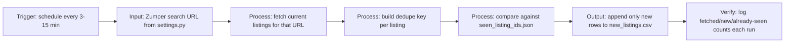

# Proposal - Python Script to Monitor Rental Listings & Export to CSV

**Job URL:** https://www.upwork.com/jobs/Python-Script-Monitor-Rental-Listings-Export-CSV_~022086865407392674061/
**Live demo:** [PENDING DEPLOYMENT -- Streamlit Cloud link to be added before submission]
**Repo:** https://github.com/PureGit90/zumper-rental-monitor-demo

---

## 1. Demo Link (line 1)

**Live demo: [Streamlit Cloud link -- add once deployed]**
Built this against the exact spec in the post: drop in any Zumper search URL, it fetches listings, skips anything already seen, and appends only new rows to CSV.

## 2. Hook

Built the script already. Point it at any Zumper search URL, filters and all, and it exports new listings to CSV on a repeatable schedule, no duplicates, ever.

## 3. Demo Reference

- Takes any Zumper search URL as-is, city/price/bed filters included, one line to change in `settings.py`
- Fetches listings, builds a dedupe key per listing, and only writes rows that haven't been seen before
- Exports exactly the columns asked for: Title, Price, Beds/Baths, Sqft, Full Address, Listing URL, Amenities, plus a first-seen timestamp
- Streamlit demo lets you click "Run scan now" repeatedly and watch the dedupe count climb, same behavior a real scheduled run would show
- Sample data mode built in, so the whole fetch to dedupe to CSV loop is visible with zero setup before touching your real search URL

## 4. Architecture

**Trigger:** scheduled run every 3-15 minutes (your spec)
**Input:** Zumper search URL, set once in `settings.py`
**Processing:** fetch current listings for that URL, build a dedupe key, check against previously seen listing IDs
**Output:** append only new rows to `new_listings.csv`
**Verification:** each run logs fetched / new / already-seen counts so you can confirm it caught something without opening the file

## 5. Tech Stack & Timeline

**Stack:** Python, requests, BeautifulSoup, csv/json standard library
**Timeline:** same day delivery, this is already built and tested
**What you get:**
- The script (`monitor.py`), config file (`settings.py`), and dedupe state file
- Set up to run on a schedule via cron or a simple loop, your choice
- Quick note on the one thing worth flagging: Zumper renders listings with JavaScript, so getting it live and reliable may need a small adjustment (headless browser fetch instead of a plain request) once we're pointed at your real search URL, happy to sort that out as part of this job

## 6. Pricing + Phase 2

**Phase 1 (this project): $35 flat, matching your posted budget**
- The script built and delivered, configured for your specific Zumper search URL
- Verified working against live results before handoff
- Settings file so you can change the search URL or poll interval yourself later

**Phase 2 (only if useful down the line):**
- Email or Slack alert on new listings instead of just CSV
- Multiple search URLs monitored in parallel (different cities/filters)
- Push straight into a spreadsheet or CRM instead of a local CSV

---

## Notes for Marco (Gate 2)

- This is a $35 fixed-price job, treated as a fast trust-builder per the Closing Playbook, not a real revenue play. Bid matches the client's stated budget exactly, no upsell in the opening message.
- Client: member since Aug 6, 2026 (5 days old), Richmond Hill, Canada, 1 hire, 1 active job, last viewed applicants 4 hours ago. New account, thin history, but actively engaged (1 hire already, checking applicants same day). No 0% hire rate flag.
- Competition: 20-50 proposals already in, on the high end but under the 50+ hard filter. Boost this one if 4th place costs <=25 Connects, per the 2026-07-20 review-run rule (score is 4.0, boost-eligible by the "boost every 4.0+" default).
- Demo link above is a placeholder pending Streamlit Cloud deployment (handled separately). Fill in before submitting, per the demo-attachments and demo-ui-strategy conventions -- do not submit with the placeholder still in place.
- Zumper's search results are JS-rendered, so the demo's live-fetch path is a best-effort attempt that falls back to sample data. Flagged honestly in the proposal itself rather than glossed over, since the client will likely test this against their real search URL first thing.
