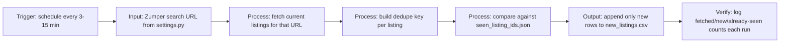

# Workflow — Zumper Rental Listings Monitor

## How each layer maps to the client's requirements

1. **Trigger** -- job asked for "run on a schedule (e.g. every 3-15 mins)." `settings.POLL_INTERVAL_MINUTES` controls this; in production, `monitor.py` runs under cron or a simple `while True: run_scan(); sleep(...)` loop.
2. **Input** -- job asked to "accept any Zumper search URL with filters (city, price, beds)." The script takes the URL as-is, no separate filter config -- whatever's encoded in the URL (city, price range, bedrooms) is what gets searched. Change it in one place: `settings.SEARCH_URL`.
3. **Processing** -- two steps: fetch listings for the given URL, then dedupe. Dedupe key is built from the listing's URL (falls back to address if a listing is ever missing one), so the same property never gets written twice even across restarts, because seen IDs persist to `seen_listing_ids.json`.
4. **Output** -- job asked for CSV with Title, Price, Beds/Baths, Sqft, Full Address, Listing URL, and Amenities. `append_to_csv()` writes exactly those columns (plus a `first_seen` timestamp), appending new rows only -- existing rows in the CSV are never touched.
5. **Verification** -- every run prints (and the Streamlit demo tracks) how many listings were fetched, how many were new, and how many were already seen. That count is the simplest way to confirm the monitor caught something without opening the CSV every time.

## Why sample data by default

Zumper renders its search results with JavaScript, so a plain HTTP GET (what `fetch_live_listings()` does) usually can't see listing data in the raw HTML -- it needs a real browser to render first. `monitor.py` ships a real attempt at a live fetch (`fetch_live_listings()`, using `requests` + `BeautifulSoup`), but it's wrapped so any failure -- blocked request, no JS-rendered content, layout change -- falls back automatically to realistic sample data instead of crashing. That's why the demo runs the full fetch -> dedupe -> CSV loop with zero setup: `_mock_listings()` in `monitor.py` generates believable Zumper-style rows (varied price, beds/baths, sqft, address, amenities) so the important part, the dedupe and export logic, is fully testable without needing live access to Zumper.

Production deployment would swap `fetch_live_listings()` for a headless-browser fetch (Playwright, same pattern used elsewhere in this kind of monitor) or Zumper's internal JSON endpoint, without touching the dedupe or CSV logic at all -- that's the whole point of keeping fetch, dedupe, and output as separate functions in `monitor.py`.
